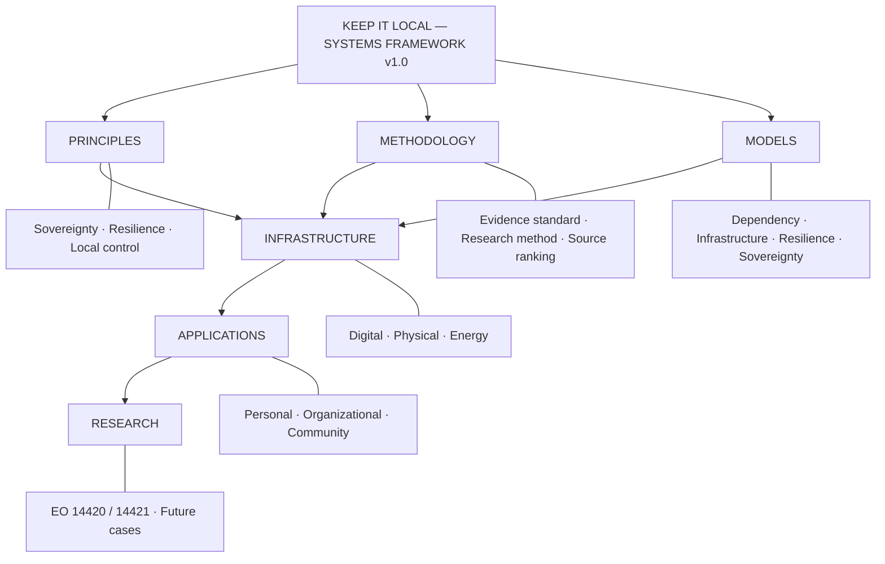

# Keep It Local — System Architecture

**Framework version:** 1.0
**Status:** Canonical architecture
**Scope:** How the Keep It Local systems framework is organized and how its parts connect.

---

## 1. Purpose

Keep It Local is a **reusable systems framework** for understanding digital infrastructure dependencies, improving resilience, increasing meaningful local control, and identifying practical alternatives to unnecessary centralized dependency.

It works at the same time for a person's digital life, a small business, an artist's practice, an AI workload, a data center, a community's digital services, or a regional infrastructure system.

This document describes the system architecture of the repository that implements the framework.

## 2. The framework stack

The framework is organized as a stack of connected layers:

```text
PRINCIPLES
    ↓
METHODOLOGY
    ↓
MODELS
    ↓
INFRASTRUCTURE
    ↓
APPLICATIONS
    ↓
RESEARCH
```



### Layer responsibilities

| Layer | Responsibility | Canonical location |
| --- | --- | --- |
| **Principles** | Define what matters: local control, data sovereignty, community resilience, sovereign AI. | `principles/` |
| **Methodology** | Define how we know: evidence classification, research process, source ranking. | `methodology/` |
| **Models** | Define how we represent systems: dependency, infrastructure stack, data model, resilience, sovereignty. | `models/` |
| **Infrastructure** | Provide reusable tools and reference material for digital, physical, and energy systems. | `infrastructure/` |
| **Applications** | Apply the framework at a concrete scale (community, personal, organizational). | `community-infrastructure/`, `examples/` |
| **Research** | Apply the full framework to real-world cases. | `research/` |

## 3. How the framework is used

The framework moves from a question to a decision:

```text
QUESTION
   ↓
EVIDENCE
   ↓
DEPENDENCIES
   ↓
SYSTEM MODEL
   ↓
INFRASTRUCTURE
   ↓
FAILURE MODES
   ↓
RESILIENCE
   ↓
CONTROL / SOVEREIGNTY
   ↓
ALTERNATIVES
   ↓
DECISION
```

Every step is governed by the **Evidence Standard**: facts and inferences are labeled, and **UNKNOWN is a valid result**. No step requires jumping to a conclusion.

### What the framework asks

1. What does this system depend on?
2. Who controls that dependency?
3. What happens if it disappears?
4. What can we keep, control, replace, export, recover, or operate locally?

## 4. Connecting digital to physical

A central thesis of the framework is that **AI infrastructure is physical infrastructure**. The framework traces dependencies from the user down to the physical layer:

```text
USER → APPLICATION → DATA → MODEL / SOFTWARE → COMPUTE → STORAGE
→ NETWORK → DATA CENTER → POWER / COOLING → UTILITY INFRASTRUCTURE → SUPPLY CHAIN
```

Any analysis may stop at the deepest layer that the evidence supports. The framework does not require inventing details.

## 5. Repository map

```text
keepitlocal/
├── README.md                  # Nontechnical entry point
├── LICENSE.md
├── architecture/              # How the framework is organized
├── principles/                # What matters
├── methodology/               # How we know
├── models/                    # How systems are represented
│   ├── dependency-model.md    #   Core model
│   ├── infrastructure-stack.md
│   ├── infrastructure-data-model.md
│   ├── resilience-model.md
│   ├── sovereignty-model.md
│   ├── infrastructure.json    #   Machine-readable example data
│   ├── infrastructure.csv
│   └── schemas/               #   JSON Schemas
├── infrastructure/            # Practical tools for digital/physical/energy systems
├── community-infrastructure/  # Reusable application domain for communities
├── examples/                  # Worked applications of the framework
├── docs/                      # Existing artifacts (e.g., PDFs)
└── research/
    └── EO_14420_14421/        # First formal case study
```

> Note: `PRD.md` (the internal build specification) is kept locally and excluded from the public repository (see `.gitignore`).

## 6. Versioning

The framework is treated as **versioned methodology**. Current version: **v1.0**.

Future versions may modify schemas, dependency classifications, evidence classifications, resilience metrics, sovereignty dimensions, or the infrastructure taxonomy. Breaking changes are documented when they occur.

### Change management

When modifying the framework:

1. Update canonical model documentation first.
2. Update schemas.
3. Update affected case studies.
4. Update examples.
5. Update README links.
6. Validate JSON schemas and internal links.
7. Review terminology consistency.

Avoid creating competing definitions in individual case studies.

## 7. Extensibility

The architecture intentionally allows future development of:

- CLI tools and dependency-mapping tools;
- interactive dependency graphs;
- community infrastructure assessments;
- machine-readable infrastructure/dependency datasets;
- visual infrastructure maps;
- risk/resilience scoring;
- local-first AI tooling;
- dependency scanners;
- digital-sovereignty assessments.

Markdown documentation is written so it can eventually become machine-readable knowledge and software without breaking the existing structure.

## 8. Non-goals of the architecture

The repository is structured to remain:

- neutral and evidence-based;
- not a political campaign or protest archive;
- not an anti-AI, anti-cloud, or anti-data-center manifesto;
- not a cybersecurity accusation platform;
- not a substitute for Indigenous-government, engineering, legal, or regulatory judgment.

The architecture deliberately separates **frameworks** (reusable, here) from **findings** (only in research, and only where evidence supports them).