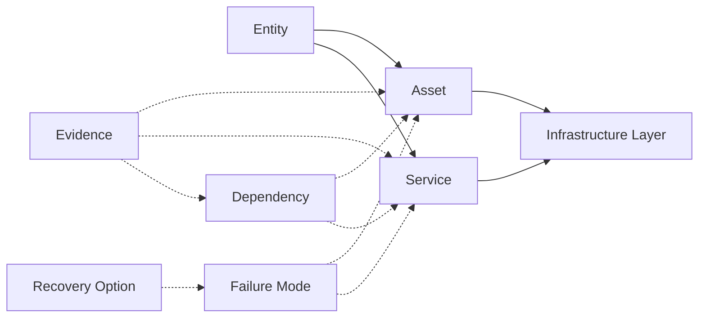

# Keep It Local — Infrastructure Data Model

**Framework version:** 1.0
**Status:** Canonical model
**Component:** Machine-readable representation
**Data files:** [`infrastructure.json`](infrastructure.json) · [`infrastructure.csv`](infrastructure.csv)
**Schemas:** [`schemas/`](schemas/)

---

## 1. Purpose

The Infrastructure Data Model defines the conceptual entities and relationships that keep It Local uses to represent systems, dependencies, and evidence as **data**.

It is designed so that Markdown documentation can eventually become machine-readable knowledge and software. Any record that follows this model can be stored in the JSON or CSV files in this directory, validated against the JSON Schemas, and used by future tooling.

## 2. Conceptual entities



### Entity

A thing under analysis — a person, business, AI workload, organization, community, or region. The root of any model instance.

### Asset

A physical or digital item that provides or stores capability:

- hardware (e.g., a NAS, a GPU server);
- software (e.g., an operating system, an application);
- a model (e.g., an open-weight LLM checkpoint);
- a dataset (e.g., a local knowledge base);
- a facility or facility component (e.g., a data center, a substation, a transformer);
- any other countable infrastructure component.

An asset has an owner, an operator, a location, and a position in the [Infrastructure Stack](infrastructure-stack.md).

### Service

A delivered capability that a system depends on. Services are often the *visible* dependency (a SaaS, an API, a telecom connection) while the underlying assets remain in the stack. A service can depend on other services and on assets.

### Dependency

A directed relationship recording that one entity depends on another, together with the dimensions defined in the [Dependency Model](dependency-model.md): type, criticality, purpose, data involved, evidence, confidence, and unknowns.

### Organization

The entity that owns, operates, governs, or supplies something. Organizations can be commercial, government, Indigenous-government, community, or individual.

### Location

A geographic place. Locations make dependencies physical and enable questions about jurisdiction, distance, and cross-border considerations.

### Infrastructure layer

One of the layers of the [Infrastructure Stack](infrastructure-stack.md):

```text
Knowledge / Data · Software / Models · Applications · Compute · Storage ·
Networking · Facility · Cooling / Water · Power · Transmission · Generation ·
Supply Chain · Governance
```

Every asset and service is placed in at least one layer.

### Evidence

A source that supports a record, together with its classification:

- **CONFIRMED** / **REPORTED** / **INFERRED** / **HYPOTHESIS** / **UNKNOWN**
- plus the source reference, date, and confidence.

Evidence follows the [Evidence Standard](../methodology/EVIDENCE_STANDARD.md).

### Failure mode

A scenario in which an asset or service fails, including the consequence for the system. Captured in the [Resilience Model](resilience-model.md).

### Recovery option

A way to recover, substitute, or continue operating after a failure mode. Recovery options belong to failure modes and are used by the Resilience Model.

## 3. Relationships

| Relationship | From | To | Meaning |
| --- | --- | --- | --- |
| depends_on | Entity/Asset/Service | Asset/Service | A dependency (the Dependency Model's core relationship) |
| owned_by | Asset/Service | Organization | The owner |
| operated_by | Asset/Service | Organization | The operator |
| located_at | Asset | Location | The physical location |
| in_layer | Asset/Service | Infrastructure layer | Position in the stack |
| supported_by | Evidence | any record | The evidence backing a claim |
| has_failure_mode | Asset/Service | Failure mode | How it fails |
| recovers_via | Failure mode | Recovery option | How recovery happens |

## 4. JSON representation

`infrastructure.json` is a single document containing collections for each entity type:

```json
{
  "$schema": "./schemas/infrastructure.schema.json",
  "frameworkVersion": "1.0",
  "generated": "YYYY-MM-DD",
  "organizations": [ ... ],
  "locations": [ ... ],
  "assets": [ ... ],
  "services": [ ... ],
  "dependencies": [ ... ],
  "failureModes": [ ... ],
  "recoveryOptions": [ ... ],
  "evidence": [ ... ]
}
```

The three top-level metadata fields are:

- `$schema` — where the validating schema lives;
- `frameworkVersion` — which Keep It Local framework version this model instance uses;
- `generated` — when the instance was created.

Records reference each other by `id` and reference evidence by `evidenceId`.

## 5. CSV representation

`infrastructure.csv` is a dependency-centric view: **one row per dependency**, with columns exported from the Dependency Model. A single flat file is easier for nontechnical users to read, edit, and use in spreadsheets. It is a projection of the richer JSON model, not a competing model. The CSV `type` column corresponds to the JSON `dependencyType` field, and the CSV `evidenceClassification` column corresponds to the JSON `classification` field on each evidence record.

Columns:

| Column | Description |
| --- | --- |
| `id` | Stable identifier for the dependency |
| `source` | The dependent system |
| `dependency` | What is depended upon |
| `type` | Dependency type (service, software, compute, energy, ...) |
| `owner` | Who owns the dependency |
| `operator` | Who operates the dependency |
| `location` | Geographic location |
| `jurisdiction` | Governing jurisdiction |
| `purpose` | What the dependency provides |
| `dataInvolved` | Data that flows through or resides in it |
| `layer` | Infrastructure layer (from the stack) |
| `criticality` | LOW / MODERATE / HIGH / CRITICAL |
| `failureMode` | How it can fail |
| `recoveryOption` | How recovery happens |
| `replaceability` | Can it be replaced, and with what |
| `portability` | Can it move elsewhere |
| `exportability` | Can data/capability be exported |
| `localAlternative` | Local alternative that exists |
| `evidence` | Source supporting the record |
| `evidenceClassification` | CONFIRMED / REPORTED / INFERRED / HYPOTHESIS / UNKNOWN |
| `confidence` | Confidence in the record |
| `status` | Research status (OPEN / VERIFIED / ... ) |

## 6. Field documentation principle

Every field in the schemas, JSON, and CSV has a documented purpose. Fields are not created for appearance. Where information is not yet known, the value is `UNKNOWN` rather than a fabricated assumption (per the Evidence Standard and the Unknown-Is-a-Valid-Result principle).

## 7. Relationship to the rest of the framework

- [Dependency Model](dependency-model.md) — defines the dimensions recorded here.
- [Infrastructure Stack](infrastructure-stack.md) — defines the `layer` values.
- [Resilience Model](resilience-model.md) — defines failure modes and recovery options.
- [Sovereignty Model](sovereignty-model.md) — defines control dimensions relevant to owner/operator.
- [Evidence Standard](../methodology/EVIDENCE_STANDARD.md) — defines evidence classification.
- [JSON Schemas](schemas/) — validate the representation.