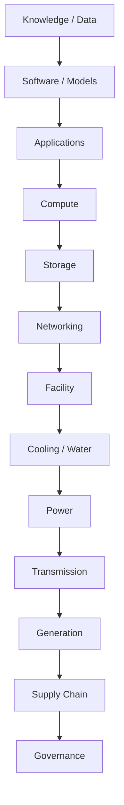

# Keep It Local — Infrastructure Stack

**Framework version:** 1.0
**Status:** Canonical model
**Component:** Infrastructure representation
**Machine-readable reference:** [`schemas/infrastructure.schema.json`](schemas/infrastructure.schema.json)

---

## 1. Purpose

The Infrastructure Stack represents infrastructure as a **layered stack** from knowledge and data down to physical supply chains and governance.

It exists to make dependency visible across the digital-to-physical boundary. The central thesis:

> **AI infrastructure is physical infrastructure.**

## 2. The stack

```text
Knowledge / Data
Software / Models
Applications
Compute
Storage
Networking
Facility
Cooling / Water
Power
Transmission
Generation
Supply Chain
Governance
```



## 3. Reading the stack

Each row is a **layer** of infrastructure. Higher layers depend on lower layers.

- **Knowledge / Data** — the information a system uses and produces.
- **Software / Models** — software, firmware, and AI models.
- **Applications** — the applications that deliver capability to users.
- **Compute** — CPU/GPU compute that runs applications and models.
- **Storage** — where data physically persists.
- **Networking** — connectivity between components.
- **Facility** — the physical building and site.
- **Cooling / Water** — cooling systems and their water supply.
- **Power** — electrical power distribution inside and to the facility.
- **Transmission** — the transmission network that delivers electricity.
- **Generation** — power generation.
- **Supply Chain** — the chain that produces and delivers equipment, fuel, and components.
- **Governance** — the rules, decisions, and control across every layer.

## 4. Dependencies can cross layers

A system is not confined to one row of the stack. Its dependencies typically **cross layers**.

Two rules:

1. **A higher layer depends on the layers beneath it.** An AI workload depends on compute, which depends on a facility, which depends on power, which depends on transmission and generation.
2. **Any layer can create its own supply-chain and governance dependencies.** The software layer has a supply chain (code, libraries, vendors). The equipment layer has a supply chain (transformers, control systems, spare parts).

### Example: AI workload

```text
AI workload
  ↓
GPU compute
  ↓
data center
  ↓
power distribution
  ↓
substation
  ↓
transmission
  ↓
generation
```

The dependence of this chain crosses many layers of the stack. Failure at any layer propagates upward.

## 5. Using the stack

To analyze a system:

1. Place the system in its layer (or layers).
2. Identify what each layer depends on beneath it.
3. Identify supply-chain and governance dependencies introduced at each layer.
4. Record each dependency using the [Dependency Model](dependency-model.md).
5. Represent the results using the [Infrastructure Data Model](infrastructure-data-model.md).
6. Ask resilience questions using the [Resilience Model](resilience-model.md).

## 6. Relationship to other models

- [Dependency Model](dependency-model.md) — the vocabulary for each relationship in the stack.
- [Infrastructure Data Model](infrastructure-data-model.md) — the data representation of stack entities.
- [Resilience Model](resilience-model.md) — failure modes across stacked layers.
- [Sovereignty Model](sovereignty-model.md) — control at each layer.